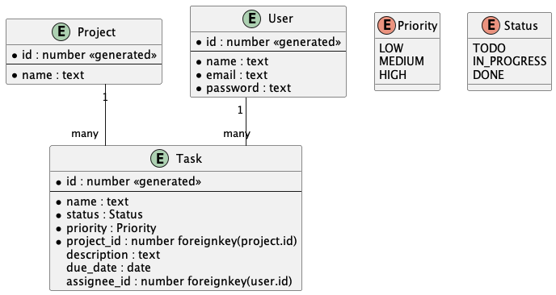

## Архитектура

## Создать базу данных:
```
$ sqlite3
sqlite> .open practice.db
sqlite> .read src/CREATE_TABLES.sql
```

## Пример вызова

Создать проект:
```shell
python -m src.projects.create
```

Создать задачу:
```shell
python -m src.tasks.create
```

Создать пользователя:
```shell
python -m src.users.create
```

Обновить задачу:
```shell
python -m src.tasks.update
```
